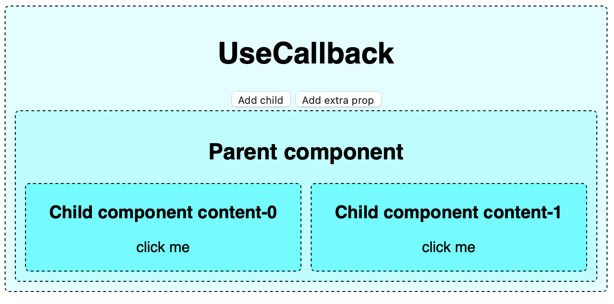
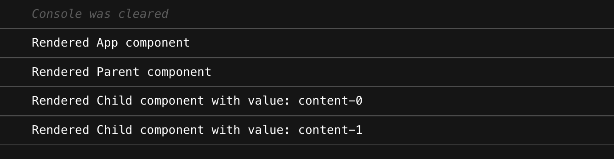
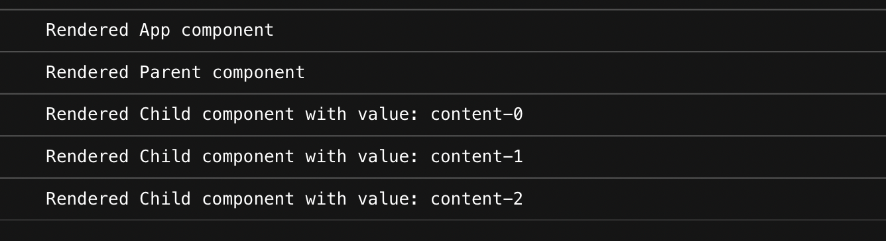
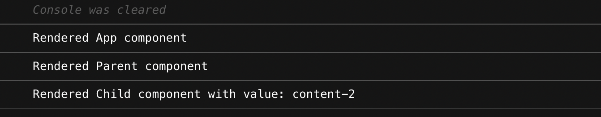
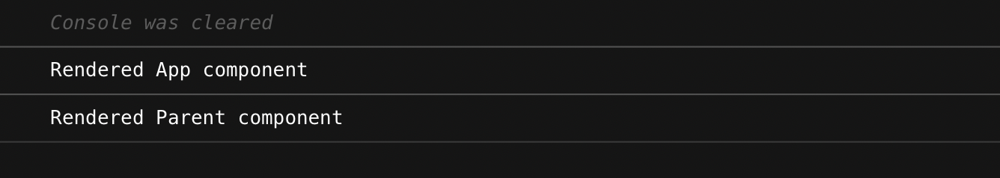

# `useCallback`

Возвращает мемоизированный колбэк.

Передайте встроенный колбэк и массив зависимостей. Хук `useCallback` вернёт мемоизированную версию колбэка, который изменяется только, если изменяются значения одной из зависимостей. Это полезно при передаче колбэков оптимизированным дочерним компонентам, которые полагаются на равенство ссылок для предотвращения ненужных рендеров (например, shouldComponentUpdate).

Документация: [React useCallback](https://ru.reactjs.org/docs/hooks-reference.html#usecallback)


## Сравнение функций в Javascript (кратко)

Рассмотрим пример: 
``` javascript
function factory() {
  return (a, b) => a + b;
}
const sum1 = factory();
const sum2 = factory();
sum1(1, 2); // => 3
sum2(1, 2); // => 3
sum1 === sum2; // => false
sum1 === sum1; // => true
```
Так, функции `sum1` и `sum2` используют один и тот же исходный код, но объявлены и сохранены в разных ячейках памяти, поэтому их сравнение оценивает как `false`. Функция равна только самой себе (ссылается на одну и ту же ячейку памяти).

## Проблема, которую решает `useCallback`
При использовании мемоизации компонентов `memo()` необходимость ререндера компонента определяется по равенству пропсов компонента. Для того, чтобы избежать лишних ререндеров для пропсов-функций, необходимо, чтобы пропсы-функции ссылались на ту же ячейку памяти, что и на предыдущем рендере.

Пример:
``` javascript
const Component = ({a, b}) => {
    const handleClick = () => doSomething(a,b);
    return (
        <ChildComponent onClick={handleClick}>content</div>
    )
}
```
При каждом ререндере компонента `Component`, код внутри функции исполняется каждый раз. Это приводит к тому, что на каждый рендер инициализируется новая функция `handleClick`. Предполагая, что компонент `ChildComponent` является мемоизированным, то переинициализация `handleClick` приводит к перерисовке `ChildComponent`.

Чтобы данная перерисовка не происходила, используется хук `useCallback`, который инициализирует новую функцию лишь в случае изменения зависимостей.

Оптимизированный пример:
``` javascript
const Component = ({a, b}) => {
    const handleClick =  useCallback(() => doSomething(a), [a]);
    return (
        <ChildComponent onClick={handleClick}>content</div>
    )
}
```
В данном случае, функция `handleClick` будет инициализироваться лишь в случае изменения пропса `a`. Данная инициализация повлечет за собой переписовку `ChildComponent`.

## Когда следует использовать `useCallback`

1. Когда функиональный компонент обернут в `memo()` и принимает функцию в качестве пропса.
2. Когда функция используется как зависимость в других хуках, например `useEffect`. 
3. Для функций с трудоемкими вычислениями.
4. Когда в функции важна неизменность внутреннего состояние, например для [функций `debounce` и `trottle`](https://dmitripavlutin.com/react-throttle-debounce/).

## Примеры использования `useCallback`

**Предупреждение:** *Все описанные примеры ниже ориентированы на сокращение количества перерисовок дочерних элементов. В данном случае не рассматривается perfomance итогового кода, получаемый в ходе данных оптимизаций. Не всегда использование мемоизации оправдано. [Мнение умных людей](https://kentcdodds.com/blog/usememo-and-usecallback)*

[Песочница](https://codesandbox.io/s/blissful-cloud-0810w?file=/src/index.js) со всеми описанными примерами для самостоятельного запуска кода.

Построим простое приложение, которое поможет наглядно оценить как можно использовать `useCallback` для сокращения числа перерисовок дочерних компонентов. Внешний вид приложения:



Приложение будет состоять из трех компонентов, вложенных друг в друга. Компонент `App`, в котором хранится состояние дочернего компонента `Parent`. В компоненте `Parent` вложено множество компонентов `Child`.

С помощью кнопок `Add child` и `Add extra prop` меняется состояние `Parent`. Количество дочерных компонентов и дополнительный проп специально вынесены на уровень компонента `App` для созданий сложного уровня зависимостей в перерисовке. `Add child`, очевидно, добавляет 1 компонент `Child` в компоненте `Parent`. `Add extra prop` просто вызывает перерисовку компонента `Parent` без изменения числа дочерних элементов.

Упрощенный листинг компонента `App`:

``` javascript
export default function App() {
  const [childCount, setChildCount] = useState(2);
  const [extraProp, setExtraProp] = useState(2);
  const items = new Array(childCount).fill("content")

  return (
    <div>
        <button onClick={() => setChildCount((prev) => prev + 1)}>
            Add child
        </button>
        <button onClick={() => setExtraProp((prev) => prev + 1)}>
            Add extra prop
        </button>

        <Parent 
            items={items} 
            extraProp={extraProp} 
        />
    </div>
  );
}
```

Упрощенный листинг компонента `Child`:

```javascript
export const Child = memo(({ value, onClick }) => {
  return (
    <div onClick={onClick} >
      <h3>Child component {value}</h3>
      <p>click me</p>
    </div>
  );
});
```

Упрощенный листинг компонента `Parent`:

``` javascript
export const Parent = memo(({ items }) => {
  const handleClick = () => {
    console.log("Clicked item");
  };

  return (
    <div>
        <h2>Parent component</h2>
        
        {items.map((item) => (
            <Child
                key={`child-${item}`}
                value={item}
                onClick={handleClick}
            />
        ))}
    </div>
  );
});
```

При первоначальной загрузке приложения отрисуются следующие компоненты:



Если нажать `Add child`:



Если нажать `Add extra prop`:


Можно заметить, что при любых изменения пропсов компонента `Parent` производится полная перерисовка всех дочерних компонентов. Эту ситуацию можно изменить, обернув функцию `handleClick`  в хук `useCallback`:

``` javascript
  const handleClick = useCallback(() => {
    console.log("Clicked item");
  },[]);
```

Если нажать `Add child` после изменений, то видно что не происходит лишних перерисовок компонентов `Child`, которые не изменялись:



Аналогично, при нажатии `Add extra prop` после изменений:




Усложним текущий вариант использования коллбэка. Допустим нам необходимо, чтобы `handleClick` принимал следующий вид:

``` javascript
const handleClick = (item) => () => {
    console.log(`Clicked item: ${item}`);
};

...

return (
    ...
        {items.map((item) => (
          <Child
            key={`child-${item}`}
            value={item}
            onClick={handleClick(item)}
          />
        ))}
    ...
  );
```

В текущей реализации на любое изменение пропсов произойдет перерисовка всей вложенности компонентов. Оптимизировать при помощи `useCallback` можно следующим образом:

``` javascript
const handleClick = useCallback(
    (item) => () => {
      console.log(`Clicked item: ${item}`);
    },
    []
);
```

При этом изменится использование функции:

``` javascript
export const Parent = memo(({ items }) => {
  return (
    ...
        {items.map((item) => (
        <Child
            key={`child-${item}`}
            value={item}
            onClick={handleClick}
        />
        ))}
    ...
  );
});


export const Child = memo(({ value, onClick }) => {
  return (
    <div className="Child" onClick={onClick(value)}>
      <h3>Child component {value}</h3>
      <p>click me</p>
    </div>
  );
});

```

Только в таком варианте можно мемоизировать функцию, возвращающую другую функцию с сохранением ссылочного равенства. Результат оптимизации (количества перерисовок) соответсвует предыдущим результатам.

Если требуется использовать функцию только в следующем виде:
``` javascript
    <Child
        key={`child-${item}`}
        value={item}
        onClick={handleClick(item)}
    />
```
то использовать мемоизацию не существует возможности (я не нашла).

Разберемся подробнее. Когда мы пишем следующую функцию, то фактически мы мемоизируем функцию `(item) => { function body }`.
``` javascript
const handleClick = useCallback(
    (item) => () => {
      console.log(`Clicked item: ${item}`);
    },
    []
);
```
Когда мы используем данный коллбэк в виде `onClick={handleClick(item)}`, то фактически мы инициализируем функцию `() => { console.log() }`, которая возвращается из мемоизированного коллбэка, на каждую перерисовку. 

Использовать следующий вариант также нельзя, так как он нарушает [правила использования хуков](https://ru.reactjs.org/docs/hooks-rules.html#only-call-hooks-at-the-top-level):
``` javascript
const handleClick = useCallback(
    (item) => useCallback(() => {
      console.log(`Clicked item: ${item}`);
    }, []),
    []
);
```

При данном варианте использовать `useCallback` для функции `(item) => { function body }` нет смысла, так как результат мемозации не используется, поэтому в таких случаях не стоит использовать мемоизацию и оставить работу реакту ([ведь он с ней и так хорошо справляется](https://ru.reactjs.org/docs/hooks-faq.html#are-hooks-slow-because-of-creating-functions-in-render)).

## Выводы
`useCallback` используется для мемоизации функции (фактически сохранения ссылочного равенства функции).

Использовать стоит в следующих случаях:
1. Когда функиональный компонент обернут в `memo()` и принимает функцию в качестве пропса.
2. Когда функция используется как зависимость в других хуках, например `useEffect`. 
3. Для функций с трудоемкими вычислениями.
4. Когда в функции важна неизменность внутреннего состояние, например для [функций `debounce` и `trottle`](https://dmitripavlutin.com/react-throttle-debounce/).

Но при этом стоит держать в голове мысль, что оптимизация должна быть во благо :)

[Песочница](https://codesandbox.io/s/blissful-cloud-0810w?file=/src/index.js)